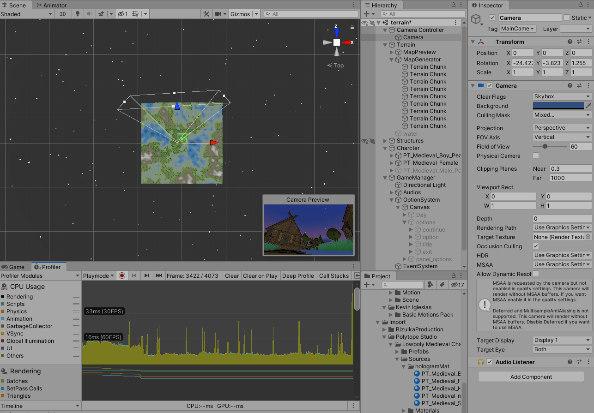

# Unity_Project

## Tutorial Demo

## terrain
Perlin Noise를 사용해 Height map 생성 이후 Color 및 Texture 작업 후 Mesh 생성.

1. 하나의 Perlin Noise를 사용하면 평평하기 때문에 여러 개의 Perline Noise 생성한다.

| 변수 | 설명 |
| :--------: | :------: |
| Octave | Perline Noise를 생성할 갯수 |
| Lacunarity | Octave의 빈도 증가값 |
| Persistance | Octave의 진폭 감소값 |

각각의 Octave 들의 빈도와 진폭을 조절해 알맞은 Octave를 만들어 합친다.

2. 노이즈 맵의 값을 이용해Height Curve의 높이 값을 추출하여 높이 값을 구한다.
높이 = 추출한 Height Curve 높이 값 * 높이에 곱하는 수 
| 변수 | 설명 |
| :--------: | :------: |
| Height Curve | 0과 1의 사이에 대한 높이 값   |
| Height Multiplier | 높이에 곱하는 수  |

3. 삼각형의 표면을 가지는 mesh 생성한다.

4. Level of detail 설정에 따라 mesh 생성시 필요한 정점들의 간격을 둔다. 

플레이어와 떨어진 거리에 있는 Terrain의 위치에 따라 설정한 임의의 간격을 두고 mesh를 생성한다.
플레이어와 가까이 있으면 간격을 적게 두고 mesh를 생성하고, 있으면 간격을 멀리 두고 mesh를 생성한다

5. 플레이어 위치를 중심으로 일정거리 안의 Terrain Object은 활성화한다. (없으면 생성한다.)
플레이어가 있는 Terrain에서 멀리 떨어져 있는 Terrain Object는 비활성화한다.

6.	대기열에 항목이 있을 때마다 콜백을 호출해 지도 데이터를 전달하는 방식이다.

콜백을 호출해야 하는 이유는 Map data와 Mesh data계산을 처리하는 동안 게임이 멈출 수 있기 때문이다. 

## shader

